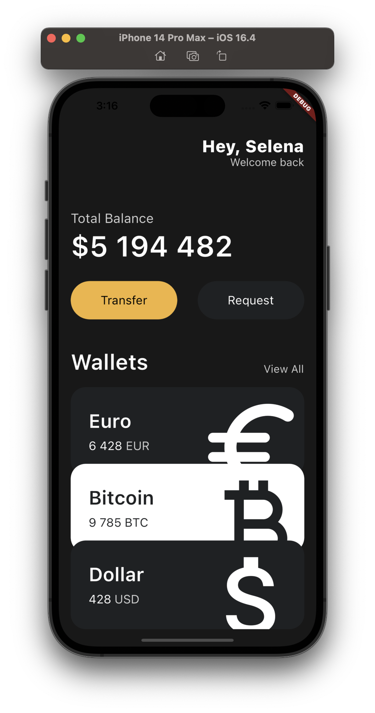

# WIL4

## UI 구현

지금까지 배웠던 다트 언어와 플러터 기본 위젯에 대한 지식으로 간단한 UI를 구현하였다.  
여러가지 위젯들을 사용하면서 위젯 트리를 구성하는 것에 대해 많이 익숙해졌다.  
제일 기본이 되는 MaterialApp 위젯 밑에 뼈대가 되는 Scaffold 위젯을 구성하고, AppBar 및 Body를 구성하여 UI를 구현하게 된다.  
Body에 Column을 배치하고 여러 위젯들을 Column의 자식들로 구현하면서 화면을 위에서부터 아래로 차근차근 구현해 나갈 수 있었다.

기존에 배웠던 여러가지 위젯들을 활용하면서 해당 위젯들의 사용법에 대해 익숙해질 수 있었고 새로운 위젯에 대해서도 배울 수 있었다.
Transform 이라는 새로운 위젯에 대해서 알게되었다.  
Transform.scale 생성자를 통해 특정 위젯의 크기를 키울 수 있다.  
이 위젯의 경우, Container 위젯 밑에 있는 Icon의 크기를 키우기 위해서 사용하였다.  
아이콘 위젯의 size 속성을 통해서도 크기를 키울 수 있지만, 이렇게 사이즈를 키우게 되면 아이콘의 크기가 커지면서 아이콘을 감싸고 있는 Container의 크기도 같이 커지게 된다.  
이때, Container의 크기는 키우지 않고, Icon의 크기만 키우기 위해서 Transform.scale 을 사용하였다.  
또한 Trasform.translate 를 통해 offset을 지정해주어, 위젯의 x,y 위치를 조정해 주는 방법도 배웠다.

```dart
Transform.scale(
  scale: 2.2,
  child: Transform.translate(
    offset: const Offset(-5, 12),
    child: Icon(
      icon,
      color: isInverted ? _blackColor : Colors.white,
      size: 88,
    ),
  ),
),
```

위와 같이 Transform 위젯을 사용하여 Icon의 크기와 위치를 조정할 수 있었다.  
또한, 위젯의 속성을 지정해주기 위해 인자를 입력해줄때,
위의 Icon의 color 속성을 지정해 주는 것과 같이 삼항연산자를 이용하여
특정 조건을 기준으로 속성을 다르게 입력해 줄 수도 있었다.

또한, 커스텀 위젯을 만들어 코드를 재사용하는 방법도 배웠다.

아래가 최종적으로 구현한 UI이다.

